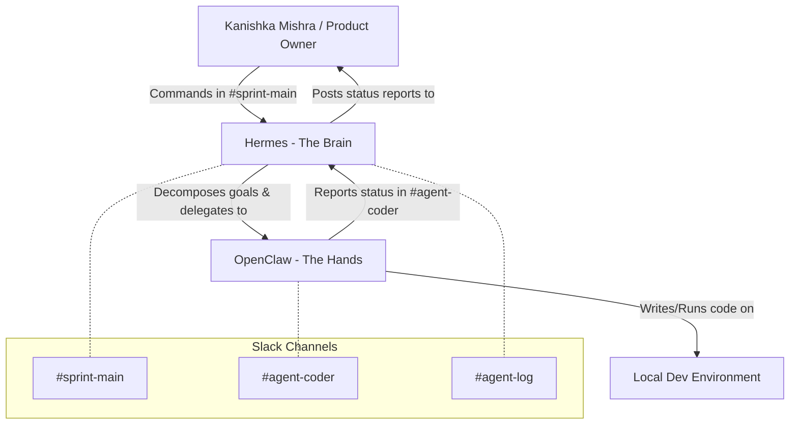

# System Architecture - AgileBoard Kanban (Kanishka Mishra)

This document describes the two-agent setup (Brain + Hands) wired through Slack to develop and maintain the AgileBoard application for Kanishka Mishra.

## Agent Breakdown & Roles

### 1. Hermes (The Brain)
*   **Role**: Orchestrator, Planner, and Decision Maker.
*   **Functionality**:
    *   Maintains context and session memory across runs.
    *   Decomposes goals provided by the Human in `#sprint-main` into concrete, step-by-step coding tasks.
    *   Triggers status-report skill (`skills/status-report/SKILL.md`) to report progress.
    *   Delegates coding execution to OpenClaw via `#agent-coder`.

### 2. OpenClaw (The Hands)
*   **Role**: Coding Agent and Executor.
*   **Functionality**:
    *   Subscribes to `#agent-coder` for assignments.
    *   Performs file I/O, installs dependencies, runs database migrations, compiles production bundles, and launches dev servers.
    *   Reports task completion status and errors directly back to `#agent-coder`.

---

## Slack Channel Scheme

*   **`#sprint-main`**:
    *   *Purpose*: High-level direction and plan approvals.
    *   *Actors*: Human $\leftrightarrow$ Hermes.
*   **`#agent-coder`**:
    *   *Purpose*: Work assignment and progress reporting.
    *   *Actors*: Hermes $\leftrightarrow$ OpenClaw.
*   **`#agent-log`**:
    *   *Purpose*: Raw activities log and audit trail.
    *   *Actors*: Event notifications, system logs, autonomous runs (cron schedules).

---

## Model Routing

We configure routing using the "Strong Brain, Fast Hands" philosophy:

| Agent | Task Type | Model Used | Provider | Rationale |
|---|---|---|---|---|
| **Hermes** | Planning / Memory | `gemini-2.5-flash` / `openai/gpt-oss-120b` | Gemini / Groq | Requires deep reasoning, broad context retrieval, and low rate of hallucination to split goals into distinct steps. |
| **OpenClaw** | Code Execution | `ollama/qwen2.5-coder` / `llama-3.3-70b-versatile` | Ollama (Local) / Groq | Requires highly optimized coding capabilities. Running qwen2.5-coder locally provides unlimited execution context and avoids cloud API rate limits (TPM/RPM limits on free tiers). |

### Fallback Ladder (on 429 / Rate Limits)
1. **Groq** `openai/gpt-oss-120b` (Primary Planning)
2. **Google Gemini** `gemini-2.5-flash` (Secondary Planning)
3. **Cerebras / OpenRouter** (Cloud Executing)
4. **Ollama** `qwen2.5-coder` (Local execution fallback, unlimited tokens)
